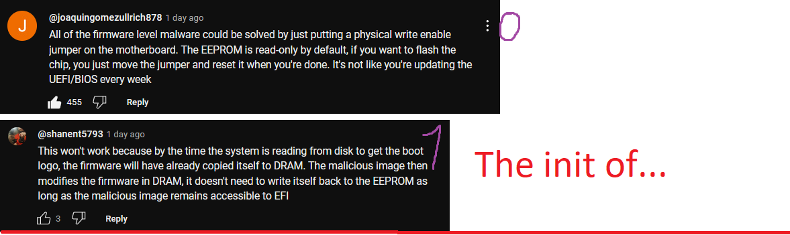
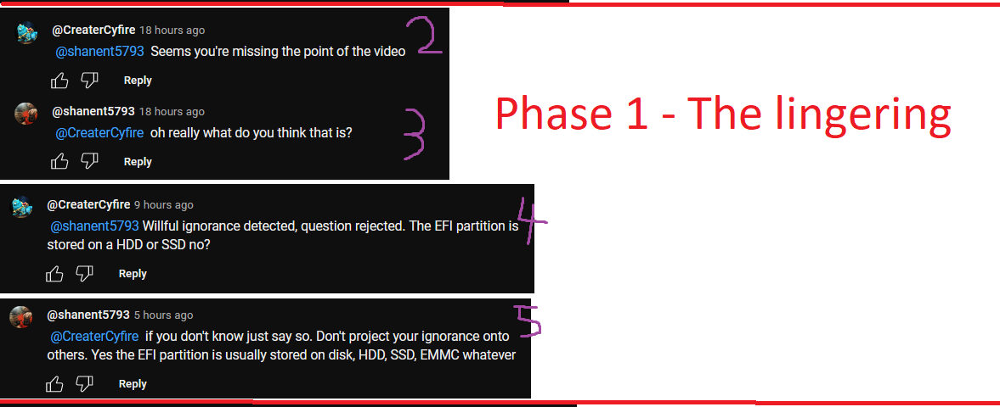
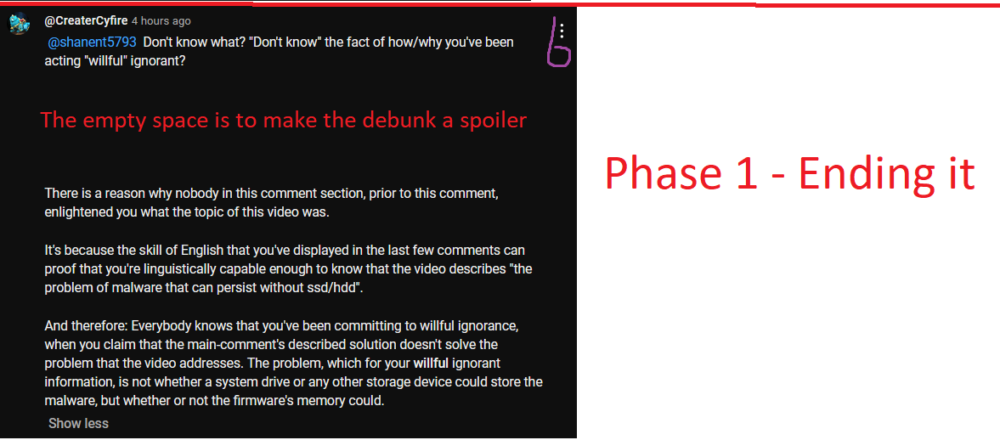
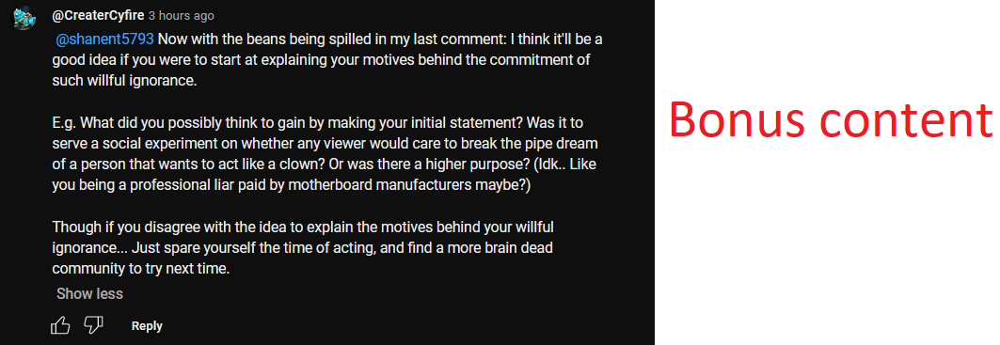
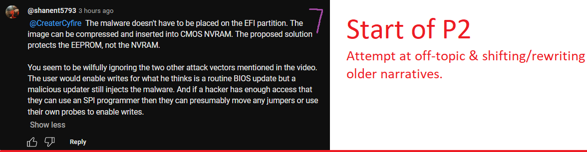
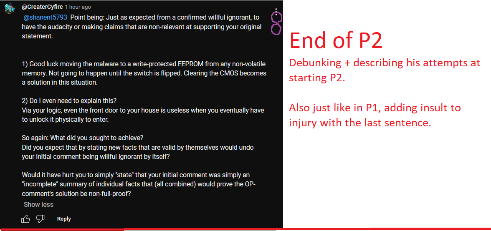
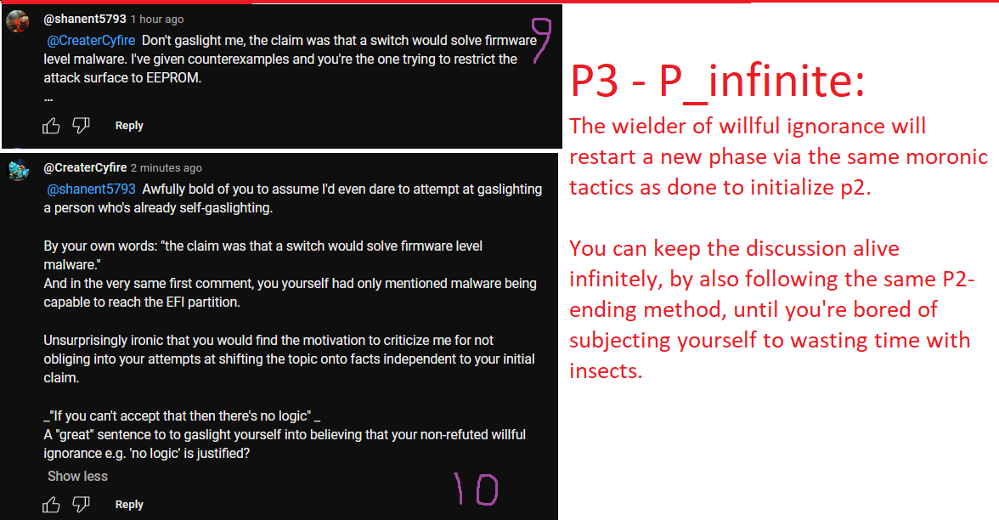

# The tip of the Iceberg: Into the practice of [Willful Ignorance](https://rationalwiki.org/wiki/Willful_ignorance)
> As an experienced Wartune player or even as a human in modern society, aka *"seen/experienced a lot of willful ignorance..."* 
> I will attempt at educating my personal experience against willful ignorance through abstract description. In addition, I aim to *-over time-* gather and grow this repository with the latest willful ignorance encounters on the internet, so be on the lookout!

## Disclaimer
In this document I'll be making my own (English) term definitions to describe the topic. This is because I am not by any means a professional to social studies, but a mere owner of >=1 brain cell(s) who coincidentally even knows how to use those cells. Therefore as I cba to spend time on searching existing literature of that nature, better e.g. more complete and/or better defined text may already exist.

Oh! And of course it goes without saying that my skills in English aren't anything to be amazed at either, so expect a lot of typos and grammar errors.

## 1. The abstract description of willful ignorance
To attempt at making things more comprehensive, we'll artificially break down the topic into multiple phases of progression.

### The initiation of- "or" The insertion into- a discussion
Everything begins with 1 or multiple individual(s) initializing their first act of willful ignorance into a conversation.
> Being heavily topic-dependent, potential motives behind the committing of said cardinal sin are either (to a degree) *inferable*, or they're a *complete mystery*. 

Cases that fall into the first category (afaik) either involve ulterior motives, or are fueled by utterly mental feebleness. In better summary:
1. "An excuse" for the commitment of other cardinal sins or crime such as governments stealing/laundering money with cheap excuses, having no interest in hiring a competent story writer for the job.
2. Said person's mental state being forced into the real world, when his/her ego is felt to be hurt by the relevant conversation. As a result: The cardinal sin becomes a coping mechanism that touches the real world *(in which the mental hurt's been dealt)*, before "the coping" has any sign of effect for the committer.
3. Potentially many more reasons that I can't even detect while others can. *(Again: I'm not a social professional.)*

In cases that fall under the latter category where there's absolutely no reasonable explanation, then...
 Said person's a pathological liar and/or pathological a$$hole: His/her entire existence itself hangs on a thread of being as much "a waste of space" as possible.

### Phase 1: Lingering of the non-substantial 
In (too) many cases <ins>people will never progress beyond this phase</ins> and eventually segue into a crossfire of off-topic inclusion, improperly-supported belittling, (personal) accusations and so on...

This is what would happen when nobody (involved in the discussion) is capable to break the ice via the following solution:
 By **1)** fully exposing- & debunking- the willful ignorance and **2)** 'optionally' add salt to the wound against the debunked initiator. 

### Phase 2: Attempt at higher-magnitude self-clowning
As the header suggests, this is the phase where the user of willful ignorance would commit to (further) shame himself in the conversation. Some of the tactics that I've learnt from the internet to achieve this phase are:
1. Excusing/abusing the imperfections of the relevant [Natural Language](https://dictionary.cambridge.org/dictionary/english/natural-language). For example, purposely twistingly interpret the definition of past messages via the ambiguity of an <ins>improper/incompletely defined</ins> English term.
2. Excusing/abusing articulative ambiguity from either sides. For example: Using anyone's "incomplete" or typo-affected quote(s) as an excuse/attempt to shift the conversation's scope.
3. Downright using fallacies and weasely articulations to attempt at (manipulatively) altering or <ins>not-adressing</ins> already debunked earlier (topic-essential) statements, so to prolong a fruitless struggle.
4. Just outright elevate "the pretention" by acting as if linguistically and/or intellectually incapable to comprehend **any English sentence**, as opposed to pretentiously misunderstand a finite amount of topic-related concepts and/or logic-based thought processes.
5. And more...

Stopping this phase, all you have to do is repeat the same solution as describedto end phase 1.

### Phase 3 - infinity: "You" are also a sinner!
As you might've already guessed at this point, you already know that your average user of willful ignorance would shamelessly commit the same tactic(s) as described in phase 2, until they've breathe their last breath...
> **But that's not all there is to!!!**

Because...
- When you're arguing against willful ignorance, **you** are the only person that *(via unwritten moral rules)* **NEED** to be & remain 100% objective/truth-speaking & having constructive arguments all-time.
- On the other hand: _'The avatar of willful ignorance'_ is **never** demanded to **even once** make a valid-on-topic-statement.

So why is this ludicrous handicap even a think?!?!
> **Because you (e.g. the sane person) are committing the cardinal sin of interacting with such insect to begin with!**

This *unfair handicap* is simply your punishment for communicating with lower life forms.

## 2. What this means in Wartune...
> *Will get to writing more about this some other day...*

Just to commit another cardinal sin on top of engaging conversations with willful ignorants, I'll exert the minimum-effort at summarizing some (of too many) Wartune-inclusive sources of willful ignorance, with (yet) no constructive argumentations:

- Game- and Discord mods/mentors e.g. the game's customer service, as well as (in-company) socially high-ranked game testers e.g. players with developer contact be <ins>paid by the game company to lie to said company's customers!</ins>
- FLB e.g. minigame that's been abused as (easy/effortless) excuse to manufacture drama within groups of in-game friends.
- Any **'ego driven'** yet weak-intellectual & feeble-minded player: The type that simply cannot compete on a simple-logic-comprehending level nor on a level of executional game perfmance, which also happens to be a bad sport.
- The (sanctimonious) counterfeit-friend that loves to act on quote-unquote 'high-morals', who would crack down on the biggest leaps of logic imaginable.
- Etc...

## 3. A real world example of willful ignorance (definitely not scripted xD)
To give you a little bit of context, I've been meaning to write about this topic on behalf of the Wartune community, literally for years now! Never had I found the motivation to do so, until today...

In the following example, you'll unironically see me bait the ludicrousy out of a random user of willful ignorance on Youtube, which (I daresay) look identical to my written description about said sin.

### The initiation - A Youtube tech video
- Video URL: https://youtu.be/2QFJLszvDwg

The context of the topic involves a quote-unquote "newfound exploit" named [LogoFAIL](https://binarly.io/posts/finding_logofail_the_dangers_of_image_parsing_during_system_boot/index.html), which you can indeed read in more/better details on the original blog post.
> **Side-note 1:** *I for one would like to argue that the core-concept behind the exploit is a widely well-known fact, far older than myself who is born in 1995, but that's a whole different topic from what we're looking at today.*

> **Side-note 2:** *The guy in the video made a mistake by saying that Secure Boot verifies data within the firmware's storage space. It can only verify binaries (via certificates) from memory that's external to your UEFI/BIOS. (But this isn't necessarily crucial to know for the sake of our example-topic of willful ignorance)*

Anyway: The Youtube video addresses the concept of a firmware-level malware, which (as its name suggests can) 'potentially' get written into your motherboard's firmware (e.g. UEFI/BIOS), without the necessary need of physical access to said hardware.

Something to take note of, is that the guy in the video would go over 3 different methods that could result in malware reaching the firmware. Two methods of which don't necessarily need to involve the newfound exploit at all, cause they're **1)** physical access and **2)** malicious bios updating tools. 
> **Yea:** *If any of those cases **when** the access has already been elevated, you're obviously screwed! Nothing to be surprised of, unless the commitment of willful ignorance is present...*

So without further ado, here are the two comments that sparked the beginning:

The so-called EFI is a partition inside the same HDD/SSD that houses your operating system. Hence wiping or replacing your drive and clearing your CMOS will still work, if said malware has never been allowed to be written into the firmware to begin with. 
 <ins>To understand this fact, all that's needed to be done is watching the video.</ins>

**Clearly** we're detecting willful ignorance when someone would state, I quote:
> "it doesn't need to write itself back to the EEPROM as long as the malicious image remains accessible to EFI"

Which blatantly neglects the whole point that the topic of danger is having malware-infected motherboard firmware.

### Phase 1 - The baited out lingering

As followed, we are indeed seeing your typical form of lingering as neither side seem to make any progress. 
> **PS:** *Ignore the part where I asked whether the EFI's stored on hardware external to the motherboard.*

Unsurprisingly he's not breaking his "willful" ignorance anyway, so it's all as expected. I've just asked a very useless question xD

Seeing that I've gathered enough pointless back-and-forth comments, it became time to break the ice by indeed...
1. Properly proof/debunk the quote in question as willful ignorance
2. (optionally) add insult to injury, as a reward for spending precious milliseconds on someone that despicable.

You can read the bonus content if you want, but it doesn't really have any substance to it. (You can skip to the next section.)

### Phase 2 - The much-expected cycle of lunacy (Important!!!)

At this point, the first bit of truth has finally been injected to the conversation from his side! So that's progress xD? 
However... As we (too) are capable of reading English sentences, we're clearly reading *'aspects'* being introduced, which are **entirely independent** from his initial (willful ignorant) statement that started it all.
> **Side-note:** *Those 'aspects' are essentially <ins>in-topic</ins> with the overarching topic *"Ways to get firmware-lvl malware"*, but <ins>off-topic</ins> with the sub-topic that the respective comment section has branched into.*

Hence falling into the fallacy category that's been previously described in abstract terms. 
Using this tactic, the guy has essentially attempted to fully dodge/neglect the previously direct declarations of his willful ignorance. 
> **Hence by his alleged logic:** *"If former said thing were dodged, then 'surely' those factual-supportive arguments (which are 1 linguistic & conceptual step further) wouldn't need to be refuted to claim myself non-willful ignorant, right?!?!"*

#### Wrong!!

**Because** I had yet to gather the proof that the typical willful ignorance discussion is never-ending, so again I had to subject myself to...
1. Blatantly point out the fact that he's committing to said weasely non-arguments *(with objective support-arguments against nothingness.)*
2. Add insult to injury by (re-)affirming the fact that his most-recent arguments (by themselves) aren't wrong, but non-substantial to refute my declaration of him committing to willful ignorance.

**Of course!** The only way he could respond is via <ins>even more</ins> willful ignorance. 
As if my previous comment wasn't obvious enough, *in exposing him for stating 'new aspects' that are off-topic to the branced sub-topic we were in*, he'd **obviously** feel the urge to continue the shameless segue-narrative.

## Lastly: I predict he'll be using the "articulative ambiguity" that I've left with my final comment!
**As of the date/time of writing** I have not checked beyond comment #10, which **you** might lookup for yourself by navigating with the URLs that I've included at the bottom.

That being said, as the title suggests, I've indeed left a (probably?) huge ambiguity in one sentence, e.g.:
> *"And in the very same first comment, you yourself had only mentioned malware being capable to reach the EFI partition"*

As you might imagine from your own experience with willful ignorance, this sentence alone leaves **A LOT** of corners to be used for many more pathetic off-topic segue attempts. Such corners are:
1. I said *"only mentioned... the EFI partition"*, which is of course not the only thing he mentioned, as he also described the DRAM.
> The ambiguity that I've created, obviously involves in the fact that my first comment was *"Seems you're missing the point of the video"*, which (from my side) 'superficially' omits the other thing he pointed out. *(So this small non-disambiguation 'might' be found useful to that guy to continue his struggle.)*
2. I (again) **did not finish** the half-written argument in question.
> What I should've ended the argument with: Was (the obvious fact) that my entire involvement in the discussion had been to point out / poke fun / expose & use his willful ignorant statement to further my own literature. *(So he still has the room to act that he doesn't comprehend my half-written statement.)*

### Conclusion to the end-result
As it's been stated in the abstract description of "Willful ignorance", lingering in a waged discussion with any of such waste of space is indeed pointless. Unless it's your goal to collect snippets worth only for hatred, the only takeaways you get are **1)** (a lot of) <ins>wasted time</ins> and **2)** <ins>a high likelihood to end up as the 'unwritten' loser of modern society's morals</ins>.

E.g. morals that 'the weak' needs to have perks, hence (even) those that pretend to be ignorant should be granted such.  
**TL;DR:** It has been a long day of source-crafting to write this documentation, don't try this at home xD.

---
---
### All comment sources:
0. Original comment: https://www.youtube.com/watch?v=2QFJLszvDwg&lc=Ugwd2NYdGOu-1lXlWtF4AaABAg
1. **[Him]** Initial willful ignorant comment: https://www.youtube.com/watch?v=2QFJLszvDwg&lc=Ugwd2NYdGOu-1lXlWtF4AaABAg.A0lrV9ye_DcA0mHLm3pOD_
2. **[Me]** The first bait: https://www.youtube.com/watch?v=2QFJLszvDwg&lc=Ugwd2NYdGOu-1lXlWtF4AaABAg.A0lrV9ye_DcA0n6A2Qh-1U
3. Phase 1 willful ignorance lingering: https://www.youtube.com/watch?v=2QFJLszvDwg&lc=Ugwd2NYdGOu-1lXlWtF4AaABAg.A0lrV9ye_DcA0n8VjPvswi
4. Phase 1 - Me purposely not yet debunking anything, so he could linger 1 comment longer: https://www.youtube.com/watch?v=2QFJLszvDwg&lc=Ugwd2NYdGOu-1lXlWtF4AaABAg.A0lrV9ye_DcA0o9ljtg0gW
5. Of course he takes the bait: https://www.youtube.com/watch?v=2QFJLszvDwg&lc=Ugwd2NYdGOu-1lXlWtF4AaABAg.A0lrV9ye_DcA0oaW0BBdIH
6. Him having been baited, I finally advance the topic by debunking him: https://www.youtube.com/watch?v=2QFJLszvDwg&lc=Ugwd2NYdGOu-1lXlWtF4AaABAg.A0lrV9ye_DcA0ogg0g0zHi
7. His first off-topic attempt, e.g. deceptive argumentation: https://www.youtube.com/watch?v=2QFJLszvDwg&lc=Ugwd2NYdGOu-1lXlWtF4AaABAg.A0lrV9ye_DcA0on_Pv3-q0
8. Me shutting that down too + describing the weasel tactics he's seemingly trying: https://www.youtube.com/watch?v=2QFJLszvDwg&lc=Ugwd2NYdGOu-1lXlWtF4AaABAg.A0lrV9ye_DcA0oxng0VgKd
9. Indeed, he responds with more willful ignorance + self-reflection + more attempts to rewrite his invalid initial statement: https://www.youtube.com/watch?v=2QFJLszvDwg&lc=Ugwd2NYdGOu-1lXlWtF4AaABAg.A0lrV9ye_DcA0p0J2NUtrv
10. My final response: https://www.youtube.com/watch?v=2QFJLszvDwg&lc=Ugwd2NYdGOu-1lXlWtF4AaABAg.A0lrV9ye_DcA0p7l18iZ2H
11. The bonus content: https://www.youtube.com/watch?v=2QFJLszvDwg&lc=Ugwd2NYdGOu-1lXlWtF4AaABAg.A0lrV9ye_DcA0oj2jWY5ss
